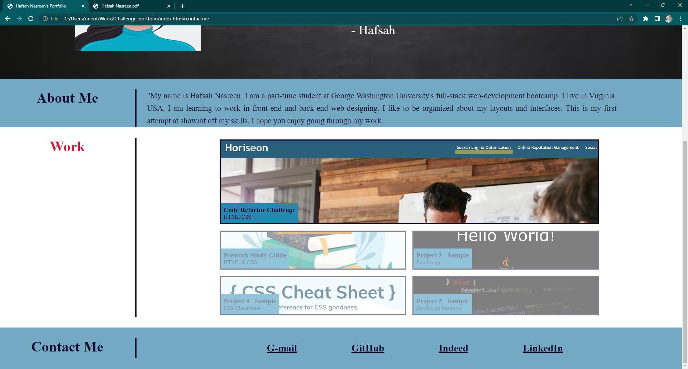

# Week-2Challenge-portfolio

## My Professional Portfolio

My motivation is to learn as much as I can from this course, in general. My aim is to learn new skills and apply them to solve real world problems. This project is built to showcase my new found skills to potential employers. This portfolio consists of a couple of projects that I have worked during the period of this course. I have included some class work activities in the work section to ensure the website has all inclusive functional links. I would add and replace the samples with actual projects as we move forward in the bootcamp. I have tried to apply everything we learned about CSS and HTML. This is a huge first step towards my career goals. Lots more to learn, all in due time.

## Table of Contents

- [Installation](#installation)

- [Usage](#usage)

- [Credits](#credits)

- [License](#license)

- [Tests](#tests)

## Installation

The URL will mostly work in all the browsers. Preferred Browser is Google Chrome and the extension Chrome DevTools Extension to view the source code. GitHub is the cloud service for projects/repositories. You can simply visit the URL to view the repository in your browser: [GitHub](https://github.com/hafsah1976/hafsah-professional-portfolio)

## Usage

[View My Professional Portfolio](https://hafsah1976.github.io/hafsah-professional-portfolio/)

The webpage follows accessibility standards. A potential employer, can use this website  to view information about me , my work, and reach out to me if they think that I am a suitable candidate for their organization.

## Credits

[Basic concepts of grid layout](https://developer.mozilla.org/en-US/docs/Web/CSS/CSS_Grid_Layout/Basic_Concepts_of_Grid_Layout)

[CSS Tricks - A complete guide to grid layout](https://css-tricks.com/snippets/css/complete-guide-grid/)

[Grid-Column](https://developer.mozilla.org/en-US/docs/Web/CSS/grid-column)

[Viewport meta tag](https://developer.mozilla.org/en-US/docs/Web/HTML/Viewport_meta_tag)

[Working with links and images](https://codecoda.com/en/blog/entry/css-working-with-links-and-images)

[Grid Wrapper](https://developer.mozilla.org/en-US/docs/Web/CSS/Layout_cookbook/Grid_wrapper)

## MIT License

Permission is hereby granted, free of charge, to any person obtaining a copy of this software and associated documentation files (the “Software”), to deal in the Software without restriction, including without limitation the rights to use, copy, modify, merge, publish, distribute, sublicense, and/or sell copies of the Software, and to permit persons to whom the Software is furnished to do so, subject to the following conditions:

The above copyright notice and this permission notice shall be included in all copies or substantial portions of the Software.

THE SOFTWARE IS PROVIDED “AS IS”, WITHOUT WARRANTY OF ANY KIND, EXPRESS OR IMPLIED, INCLUDING BUT NOT LIMITED TO THE WARRANTIES OF MERCHANTABILITY, FITNESS FOR A PARTICULAR PURPOSE AND NONINFRINGEMENT. IN NO EVENT SHALL THE AUTHORS OR COPYRIGHT HOLDERS BE LIABLE FOR ANY CLAIM, DAMAGES OR OTHER LIABILITY, WHETHER IN AN ACTION OF CONTRACT, TORT OR OTHERWISE, ARISING FROM, OUT OF OR IN CONNECTION WITH THE SOFTWARE OR THE USE OR OTHER DEALINGS IN THE SOFTWARE.

## Tests

### Test case - 1 - Checking Resume Link

Result as expected:

### Test case - 2 - Checking project 1 - Refactor Challenge

Result as expected:

### Test case - 3 - Checking project 2 - Prework Study Guide

Result as expected:

### Test case - 4 - Checking project 3 - Sample JavaScript

Result as expected:

### Test case - 5 - Checking Linked in profile

Result as expected:

